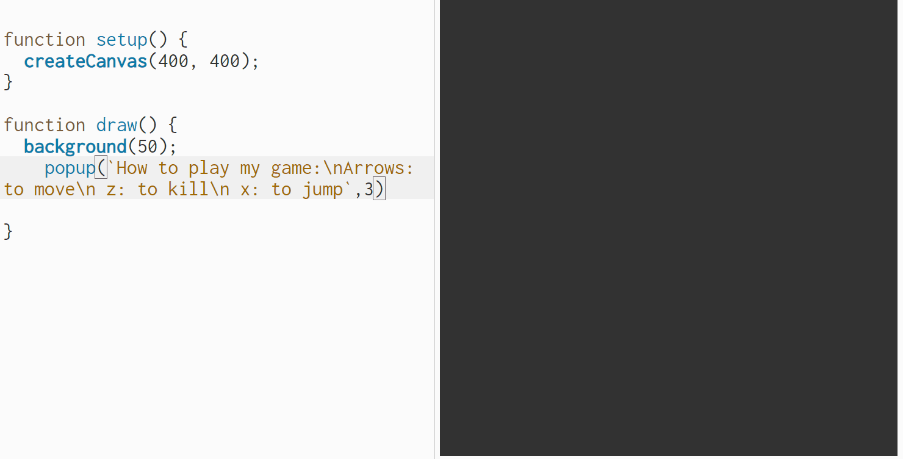

# p5.popup.js
 p5.js simple popup library used for displaying instructions for sketches
```
by oran collins
github.com/wisehackermonkey
oranbusiness@gmail.com
20200629
```

# Live Example
# [P5.js live editor](https://editor.p5js.org/wisemonkey/present/RJWfLmQBP)
# [P5.js live editable version](https://editor.p5js.org/wisemonkey/present/RJWfLmQBP)
#

# CDN Example
## CDN links
+ https://cdn.jsdelivr.net/npm/p5.popup  
+ https://unpkg.com/p5.popup
## How to use CDN links
### Add one of the following two CDN options to your p5.js sketches html file 
#### Replace X.X.X with the latest version number

```text
<!DOCTYPE html>
<html lang="en">
  <head>
    <script src="https://cdnjs.cloudflare.com/ajax/libs/p5.js/X.XX.X/p5.js"></script>
    <script src="https://cdnjs.cloudflare.com/ajax/libs/p5.js/X.XX.X/addons/p5.sound.min.js"></script>
```
```html
    <script src="https://cdn.jsdelivr.net/npm/p5.popup@0.0.3/p5.popup.min.js"></script>

    OR

    <script src="https://unpkg.com/p5.popup@0.0.3/p5.popup.min.js"></script>
```
```text
	  
    <link rel="stylesheet" type="text/css" href="style.css">
    <meta charset="utf-8" />
  </head>
  <body>
    <script src="sketch.js"></script>
  </body>
</html>
```
# Brain storm
## inital idea
```
p5.js popup for instructions on how to play game, mobile and desktop friendly
```

### add: one liner

### example
```javascript
instructions("arrows to move, goal is to get the blocks")

//have templates for common input types
instructions([ARROWS,MOUSE],"e key breaks the walls")
```

### example v2
```javascript
popup("arrows to move, goal is to get the blocks", <show for n seconds>)

//have templates for common input types
popup([ARROWS,MOUSE],"e key breaks the walls", <show for n seconds>)
```


# publish npm package
```
npm publish
```
# TODO
- github action minifiy
- auto lint
- todo add popupMode(BOTTOM)

# Links
- [replace-in-file (npm) used in build script ](https://www.npmjs.com/package/replace-in-file)